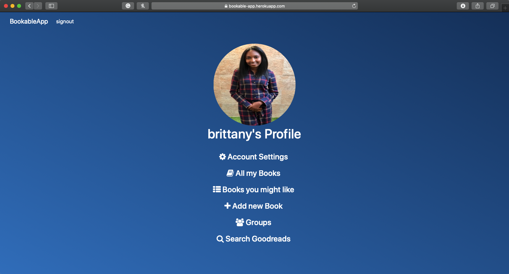
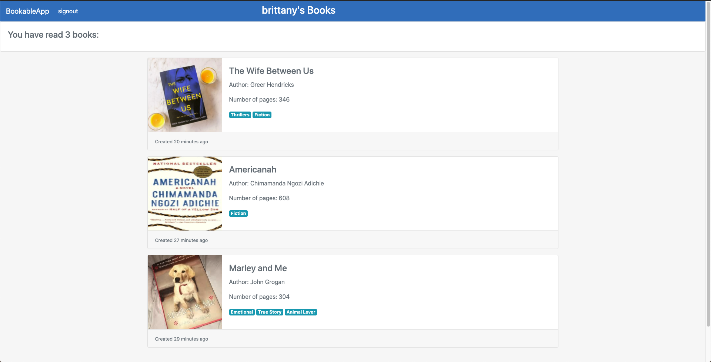
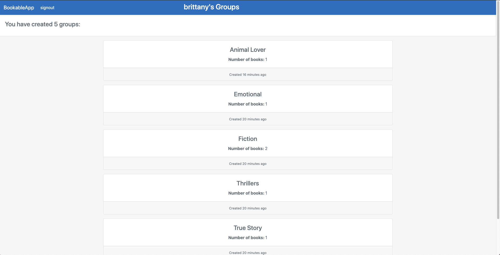

# Bookable App

<!--
*** Thanks for checking out this README Template. If you have a suggestion that would
*** make this better, please fork the repo and create a pull request or simply open
*** an issue with the tag "enhancement".
*** Thanks again! Now go create something AMAZING! :D
-->

<!-- PROJECT SHIELDS -->
<!--
*** I'm using markdown "reference style" links for readability.
*** Reference links are enclosed in brackets [ ] instead of parentheses ( ).
*** See the bottom of this document for the declaration of the reference variables
*** for contributors-url, forks-url, etc. This is an optional, concise syntax you may use.
*** https://www.markdownguide.org/basic-syntax/#reference-style-links
-->
[![Contributors][contributors-shield]][contributors-url]
[![Forks][forks-shield]][forks-url]
[![Stargazers][stars-shield]][stars-url]
[![Issues][issues-shield]][issues-url]

<!-- PROJECT LOGO -->
 

  

  <h3 align="center">Bookable App</h3>

  

    This is the Capstone Project for the Ruby on Rails section of the Microverse curriculum.
     
    <a href="https://github.com/BrittanyBlake/Bookable-app"><strong>Explore the docs »</strong></a>
     
     
    <a href="https://github.com/BrittanyBlake/Bookable-app/issues">Report Bug</a>
    ·
    <a href="https://github.com/BrittanyBlake/Bookable-app/issues">Request Feature</a>
  

<!-- TABLE OF CONTENTS -->
## Table of Contents

* [About the Project](#about-the-project)
  * [Built With](#built-with)
* [Contact](#Authors)
* [Acknowledgements](#acknowledgements)
* [How it works](#How-it-works)

<!-- ABOUT THE PROJECT -->
## About The Project
## User's Profile Page

## List of User's Books

## List of User's Groups

Capstone projects are solo projects at the end of the each of the Microverse Main Technical Curriculum sections. It is a real-world-like project built with business specifications This project was at the end of the Ruby on Rails curriculum section. For this project, I created an app that allows you to register books that you have read and group them into groups of your choosing. These groups can be either book genres or groups based on bookclubs. You are free to choose how you want to group your books. It also allows you to view books that other users of the app are using but not their personal thoughts on the project. As an extra feature, I decided to implement a search page where you can get information about a particular book via the <a href="https://www.goodreads.com">GoodReads </a>website.

## LIVE DEMO
 [Link to live demo](https://bookable-app.herokuapp.com) 

<!-- BUILD WITH -->
## Built With
This project was built using these technologies.
* Ruby-on-Rails
* Bootstrap
* PostgreSQL
* Amazon's Goodreads API
* AWS S3 Bucket

<!-- ABOUT THE PROJECT -->
## Getting Started
- To get a local copy up and running follow these simple example steps.
### Prerequisites

- Ruby: 2.6.3
- Rails: 5.2.4
- Postgres: >=9.5
- AWS S3 bucket (for the access key and secret key to upload images in production environment)
- Amazon's GoodReads API (for the access key and secret key to gain data about the books)

### Install

To test the Bookable App locally, you will need to clone the repository, navigate to it's containing directory, and run the following commands:

#### Clone the repository and follow the steps to run the app.

- $ `git clone git@github.com:BrittanyBlake/Bookable-app.git`
- $  bundle install    -> run this command to install the required gems
- $  rails db:create   -> run this command to create the databade
- $  rails db:migrate  -> run this command to run the migration
- $  rails server      -> run this command to start the live server
- Open  `http://localhost:3000/` in tour preferred browser.

### Run tests
- $  respec --format documentation

### Integration and Unit Test
- Rspec
- Capybara
- FactoryBot
- Faker

<!-- CONTACT -->
## Authors

👤 **Brittany Blake**

- Github: [@BrittanyBlake](https://github.com/BrittanyBlake)
- Twitter: [@bbcodes_](https://twitter.com/bbcodes_)
- Linkedin: [Brittany Blake](https://www.linkedin.com/in/brittany-blake-843951109/)

<!-- ACKNOWLEDGEMENTS -->
## Acknowledgements
* [Microverse](https://www.microverse.org/)
* [Ruby Documentation](https://www.ruby-lang.org/en/documentation/)
* [Template Design By Gregoire Vella](https://www.behance.net/gallery/19759151/Snapscan-iOs-design-and-branding?tracking_source=)

## Show your support

Give a ⭐️ if you like this project!

<!-- MARKDOWN LINKS & IMAGES -->
<!-- https://www.markdownguide.org/basic-syntax/#reference-style-links -->
[contributors-shield]: https://img.shields.io/github/contributors/BrittanyBlake/Bookable-app.svg?style=flat-square
[contributors-url]: https://github.com/BrittanyBlake/Bookable-app/graphs/contributors
[forks-shield]: https://img.shields.io/github/forks/BrittanyBlake/Bookable-app.svg?style=flat-square
[forks-url]: https://github.com/BrittanyBlake/Bookable-app/network/members
[stars-shield]: https://img.shields.io/github/stars/BrittanyBlake/Bookable-app.svg?style=flat-square
[stars-url]: https://github.com/BrittanyBlake/Bookable-app/stargazers
[issues-shield]: https://img.shields.io/github/issues/BrittanyBlake/Bookable-app.svg?style=flat-square
[issues-url]: https://github.com/BrittanyBlake/Bookable-app/issues

## 📝 License

This project is [MIT](https://opensource.org/licenses/MIT) licensed. Design by Gregoire Vella on Behance.
